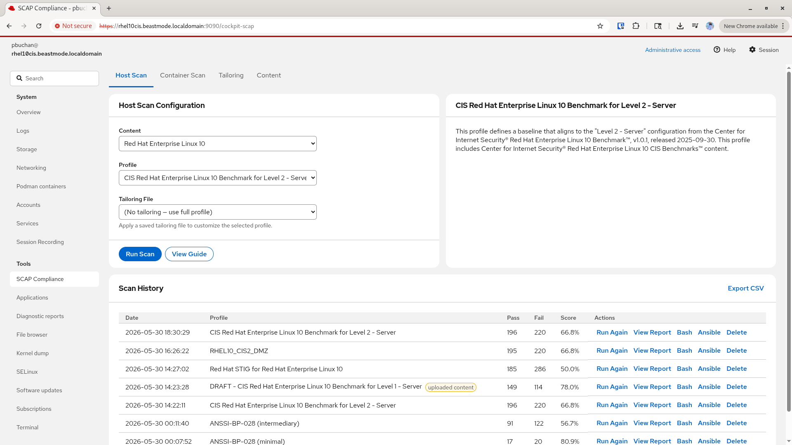
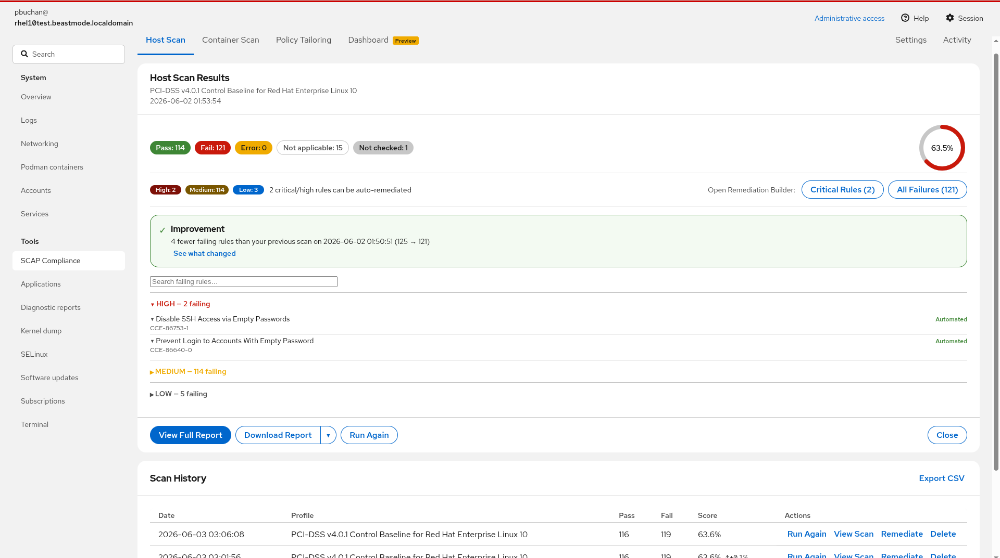
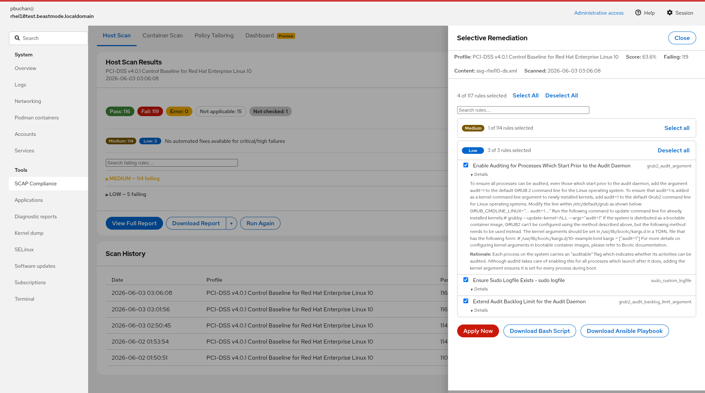
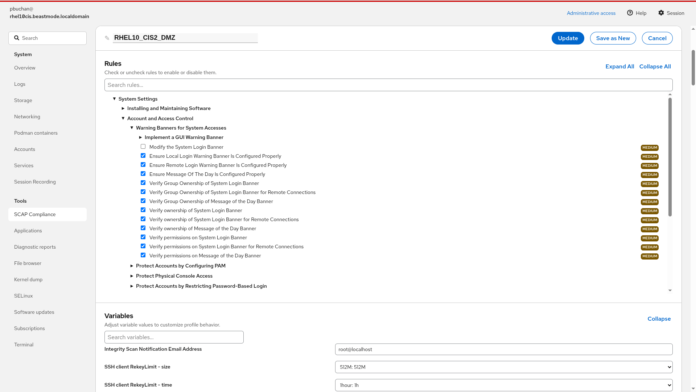

# cockpit-scap

A native [Cockpit](https://cockpit-project.org/) module for RHEL 10 / CentOS Stream 10 that brings OpenSCAP compliance scanning, container image scanning, profile tailoring, and selective remediation directly into the Cockpit browser console — no separate tools, no context switching.

## Features

- **Host scanning** — auto-detects installed SSG data streams across RHEL 6–10; shows scan ETA during the run based on prior matching scans; compliance score, severity breakdown, and regression detection on complete
- **Failing rules** — collapsible HIGH/MEDIUM/LOW groups with CCE identifiers, inline description and rationale, and Automated/Manual annotation; search by rule title or CCE
- **Selective remediation** — drawer slides in over scan results; search and select failing rules; download filtered bash or Ansible scripts; **Apply Now** remediates directly on the host with two-gate confirmation and live streaming output; **Quick Fix** pre-selects automatable critical/high rules
- **Full profile remediation** — generate a bash or Ansible script for the entire selected profile without running a scan first; available on Host Scan, Container Scan, and Tailoring tabs
- **Container image scanning** — scan images from the root Podman store via `oscap-podman`; per-image scan history, severity action bar, and remediation script download for build pipelines
- **Policy tailoring** — XCCDF rule tree editor with variable adjustment and search; upload, download, edit, and delete saved tailoring files; active tailoring file included in remediation exports
- **Scan history** — every result stored with score delta vs previous same-profile scan; reload any historical result or open it directly in the remediation drawer; configurable retention
- **Export** — HTML report, XCCDF results XML, and ARF bundle per scan; compliance guide viewable for any profile; history exportable as CSV
- **Compliance Dashboard** *(preview)* — score trend chart, risk score, severity breakdown, and unified critical findings with Quick Fix; rule detail drawer for any listed finding
- **Settings** — tab visibility toggles, scan retention, Clear All Data, Content Library (system + uploaded SDS), and manual scheduling command for cron

## Screenshots

**Host Scan — content and profile selection, scan history with score delta, and scan timing**


**Scan Results — compliance score, severity action bar, failing rules with CCE identifiers and inline description**


**Selective Remediation — select failing rules, review the script, apply directly on the host with live streaming output**


**Policy Tailoring — rule tree editor with severity indicators, search, and variable editor**


## Requirements

### Cockpit
Cockpit 344 or later on RHEL 10 / CentOS Stream 10. The module uses no Cockpit internals beyond the published
`cockpit.js` API.

### Packages

```
dnf install openscap-scanner scap-security-guide openscap-utils
```

| Package | Purpose |
|---|---|
| `openscap-scanner` | Host and container scanning (`oscap`, `oscap-podman`) |
| `scap-security-guide` | SSG data stream files for RHEL 6–10 |
| `openscap-utils` | Remediation script generation (`oscap xccdf generate fix`) |

The module detects missing packages at startup and displays installation instructions rather than failing silently.

## Installation

**RPM via Fedora COPR (recommended):**

```bash
sudo dnf copr enable pbuchan-rh/cockpit-scap
sudo dnf install cockpit-scap
```

**From source (Makefile):**

```bash
git clone https://github.com/pbuchan-rh/cockpit-scap.git
cd cockpit-scap
sudo make install
```

After installation, reload Cockpit and navigate to **SCAP Compliance** in the sidebar.

## Tips

- **Remediate from history** — clicking **Remediate** in the Scan History table loads the historical result and opens the remediation drawer directly; no need to re-run the scan
- **Tailoring files** — files saved in the Policy Tailoring tab appear automatically in the Scan tab's Tailoring File selector
- **Update vs Save as New** — when editing an existing tailoring file, **Update** overwrites it in place; **Save as New** creates a timestamped copy
- **Manual Scheduling** — the Settings tab shows the exact `oscap xccdf eval` command from your most recent scan, ready to paste into a cron job

## Storage

All runtime data is written to `/var/lib/cockpit-scap/`:

```
/var/lib/cockpit-scap/
├── results/
│   └── <TIMESTAMP>/          # One directory per scan
│       ├── manifest.json     # Scan metadata (profile, SDS, score, timing)
│       ├── report.html       # oscap HTML report
│       ├── results.xml       # oscap XML results
│       ├── remediation.sh    # Bash remediation script
│       └── remediation.yml   # Ansible remediation playbook
├── tailoring/
│   ├── <name>-<timestamp>.xml   # XCCDF tailoring file
│   └── <name>-<timestamp>.json  # Sidecar metadata
├── content/
│   └── ssg-rhel<N>-ds.xml    # User-staged SDS files (root:root ownership required)
└── remediation-logs/
    └── <TIMESTAMP>-<profile>.log  # Apply Now audit log (user, rules applied, exit code)
```

Scan history is pruned automatically after each scan. Retention defaults to 10 results per scan type and is configurable via the Settings tab (1–50).

## SELinux

The module is tested and confirmed working with SELinux in enforcing mode. All file I/O is scoped to `/var/lib/cockpit-scap/` — the SELinux file context definition is shipped with the module and applied automatically at install time via `semanage fcontext` and `restorecon`. No manual SELinux configuration required.

## Privilege model

Cockpit's native `{ superuser: "require" }` mechanism is used, scoped to scan execution, file writes, and remediation apply only. Browsing content, selecting profiles, viewing history, and generating compliance guides require no elevation. No polkit action file, sudoers entry, or setuid binary is required.

Privileged actions (Run Scan, Apply Now, upload, delete) are visually disabled with a tooltip in limited Cockpit sessions — no error popup after the fact. Elevation is requested once via the standard Cockpit prompt and applies for the session.

## Development status

**Current release:** v3.8 — available via COPR

Built with vanilla JavaScript, PatternFly 6, and the Cockpit JS API. No npm, no build toolchain,
no external CDN dependencies. Suitable for deployment on air-gapped systems.

### Roadmap

| Version | Theme |
|---|---|
| **v1** | Local SCAP scanning + full profile tailoring — closes the SCAP Workbench gap on RHEL 10 |
| **v2** | Multi-version SDS content management — RHEL 6–9 SDS staging, CPE OS detection |
| **v3** | Container image scanning — `oscap-podman`, root Podman store, per-image history |
| **v3.x** *(current)* | Selective remediation, Apply Now, compliance dashboard, drawer UX, scan ETA, ARF export, full profile remediation, action board, score trend chart |
